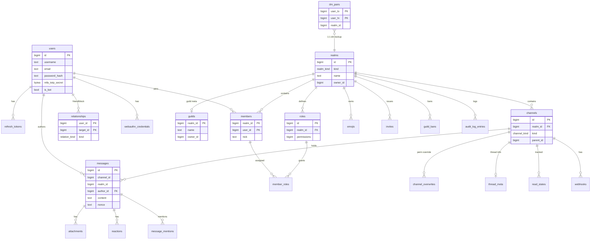

# Database — ERD (엔티티 관계도)

> 핵심 엔티티 관계. 전체 컬럼은 [02-schema.md](02-schema.md). (mermaid `erDiagram`)

---

## 관계 요약

| 관계 | 카디널리티 | 비고 |
|---|---|---|
| realm → guild | 1 : 0..1 | 길드 메타 확장 (DB-D1) |
| realm → channels | 1 : N | DM은 채널 1개, 길드는 다수 |
| realm → members | 1 : N | 모든 Realm 공용 멤버십 |
| user × realm → member | N : M (members) | 멤버십 = 교차 |
| member × role → member_roles | N : M | @everyone = role.id == realm_id |
| channel → messages | 1 : N | 메시지의 1차 컨테이너 |
| message → attachments/reactions | 1 : N | 파티셔닝 시 FK 주의(04) |
| dm_pairs → realm | N : 1 | 1:1 DM 중복 방지 조회 (DB-D2) |
| user × user → relationship | 방향성 N:M | 친구/차단, `user_id <> target_id` |

## 핵심 포인트
- **realms** 가 그래프의 허브 — 채널·멤버·역할·초대·이모지가 전부 여기에 매달림 (Realm 통일 추상 D8).
- **messages** 는 `channel_id`로 채널에, `realm_id`(비정규화)로 파티션/라우팅에 동시 연결.
- 휘발 상태(presence/session/ratelimit)는 **이 다이어그램에 없음** — DB 밖 (DB-D5).
